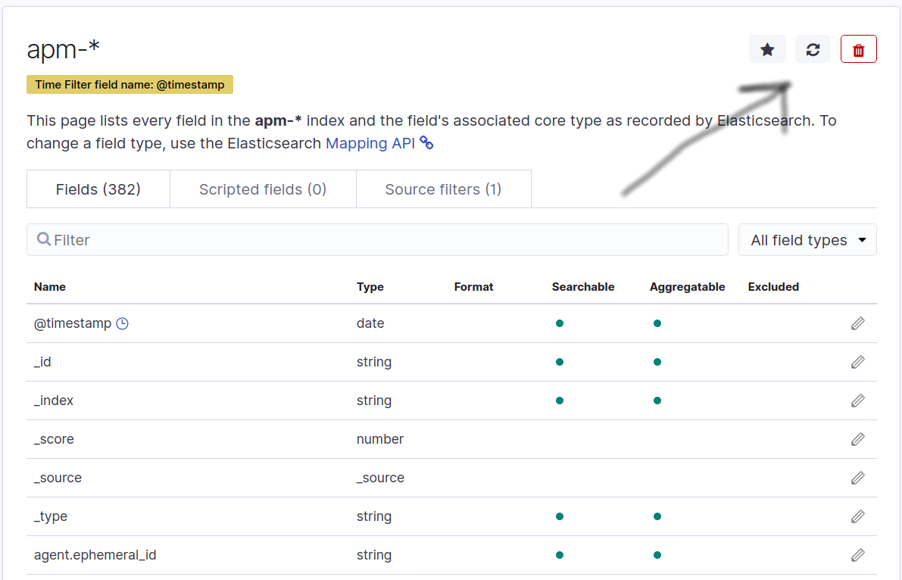
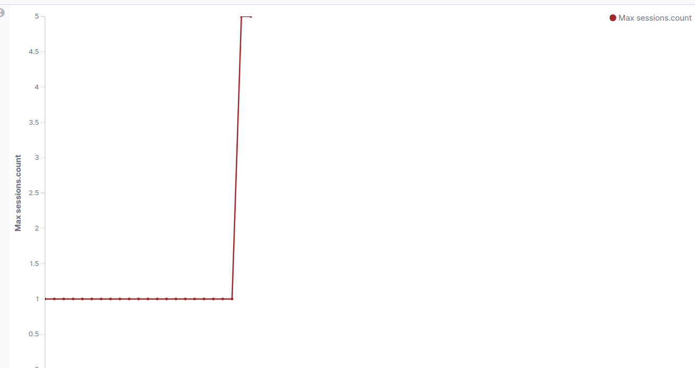

# Meteor metrics

From version 2.2.0 Meteor-elastic-apm by default comes with [meteor-measured](https://github.com/kschingiz/meteor-measured).

Meteor-measured sends a lot of useful meteor specific metrics:

Sockets Metrics:

1. Open sockets: 10 sockets open
2. Live data sockets: 8 sockets uses livedata

Session Metrics:

1. Sessions count: 8 meteor sessions

Pub/sub Metrics:

1. Subscriptions count: 100 subscriptions
2. Subscriptions count for each publication: testPub: 20 subs, notTestPub: 80 subs
3. Published documents: 20 docs published
4. Published documents for each collection: 10 docs of TestCollection published, 10 docs of NotTestCollection published

Observer Metrics:

1. Number of observers: 20 observers created
2. Number Observer drivers: Oplog drivers: 10, Polling drivers: 10
3. Number of documents for each driver: TestCollection published by oplog driver: 10

Meteor-measured uses elastic agent registry and sends metrics data directly to kibana.

## How to visualize metrics

1. Start your app with metrics, wait for some time 2-3 minutes, do something in your app to collect and send metrics. We need to wait while `elasticsearch` will save and index our metrics.
2. Go to Kibana -> Management -> Index Patterns -> `apm-*`
   You will see a list of all indexed fields, click on `Refresh Fields list` button, the button is located on top-right corner:
   

Sorry for my amazing drawing skills.

3. After Refreshing was completed try to find some of the fields which we are sending: `sessions.count`, `sockets.open`, `sockets.liveData`.

4. Time to Visualize our metrics: Go to Kibana -> Visualize -> Create Visualization.

Select `Line` chart, index pattern should be `apm-*`

5. You need to configure the chart to visualize meteor metric data. Let's draw `sessions.count` metrics, to do so you should configure chart this way:
   Y-Axis props:

```
Aggregation = Max
Field = sessions.count
Custom Label = Sessions
```

X-Axis props:

```
Aggregation = Date Histogram
Field = @timestamp
```

7. Click on blue "Apply Changes" button.
8. Configure time range to be: `30 minutes ago`. Click on "Refresh"

Repeat steps for every metric field you need, you can combine charts in Dashboard later.

Sample sessions count chart:


PS: I am not elastic search, kibana expert, maybe there is easier steps to do the same. If you want to correct something or add useful tips and tricks, I am waiting for your PRs
